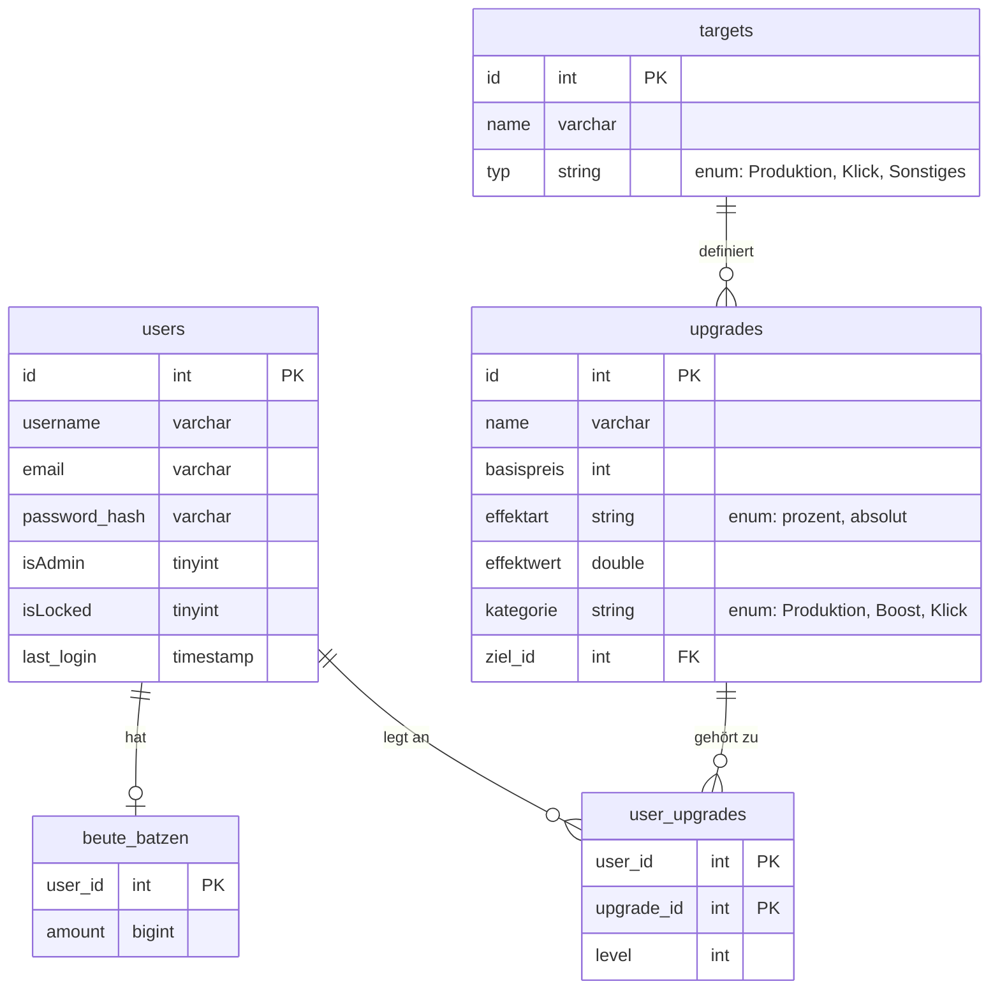

# Keller & Knilche - Gewinne maximieren, Helden minimieren

*ein Idle-Browser Game in dem du der Dungeon bist. Upgrade dein Reich und jage all diese lästigen Knilche(Helden) fort*

Wir entwickeln ein **humorvolles browserbasiertes Idle-Game**, welches als Gegenentwurf zu den Konventionen der modernen Spielindustrie stehen soll. Statt Microtransactions, aufdringlicher Werbung und Glücksspielmechaniken wollen wir auf ein **vollkommen freies Open-Source Modell** setzen.

Der Spieler **entwickelt** im Laufe der Zeit einen **Dungeon**, der sich permanent gegen **lästige Helden (“Knilche”) verteidigen** muss. Durch klassische Idle-Mechaniken wird der Dungeon nach und nach **aufgebaut, ausgebaut und skaliert**. Hierbei wollen wir auch regelmäßig satirische Einwürfe einbringen, als Anspielung auf gängige kundenunfreundliche Praktiken – insbesondere Lootboxen und Microtransactions.

Technisch setzen wir auf **HTML, CSS/Bootstrap, PHP und Javascript**. Spielstände sollen in einer relationalen Datenbank serverseitig gespeichert werden. Das Spiel wird über einen Webhosting Dienstleister, wie Hetzner, öffentlich verfügbar und der Source Code auf Github einsehbar sein.

## Verwendung (derzeitiger Stand)
1. Registrieren und einloggen
2. Homepage Bild anklicken um Batzen zu verdienen
3. Upgrades kaufen um mehr Batzen zu verdienen
4. Passiv Batzen verdienen
5. ???
6. Profit

### Features
- Schriftart wechselbar
- Responsive Design - Anpassung an mobile Endgeräte
- Ändern der Nutzerdaten auf Profilseite

## Überblick über Repo

| Ordner | Beschreibung |
| ------ | ---------- |
| src | Quellcode der Website (Unterordner für css, js, images, etc.) |
| config | Konfigurationsdateien (z.B. SQL-Skripte) |
| tests| Testfälle (z.B. Unit-Tests oder Integrationstests)|
| doc | Dokumentationen |
| logs | Log-Dateien (z.B. Error-Logs) |
| production | aktuelle Live-Version der Website |

## Datenbank ERM

